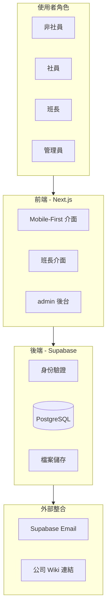
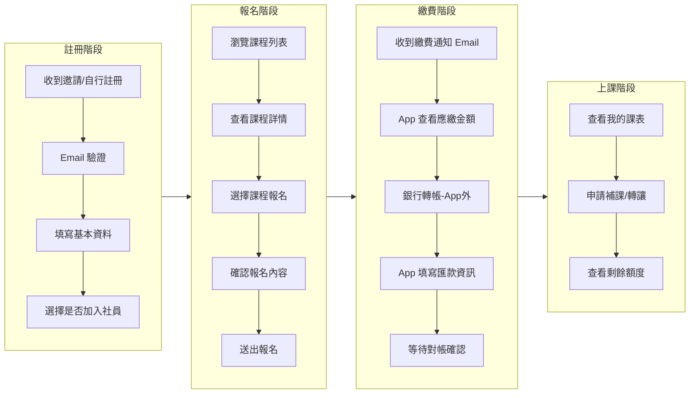
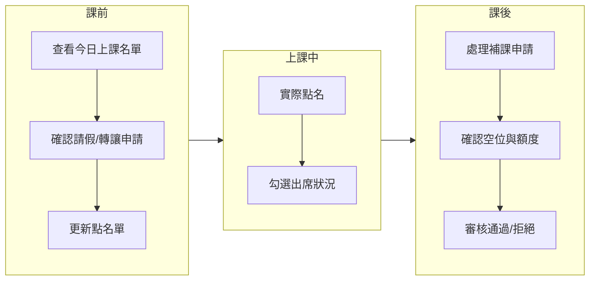
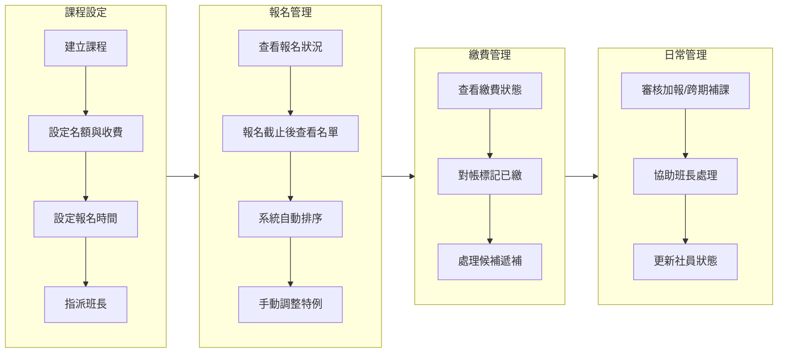
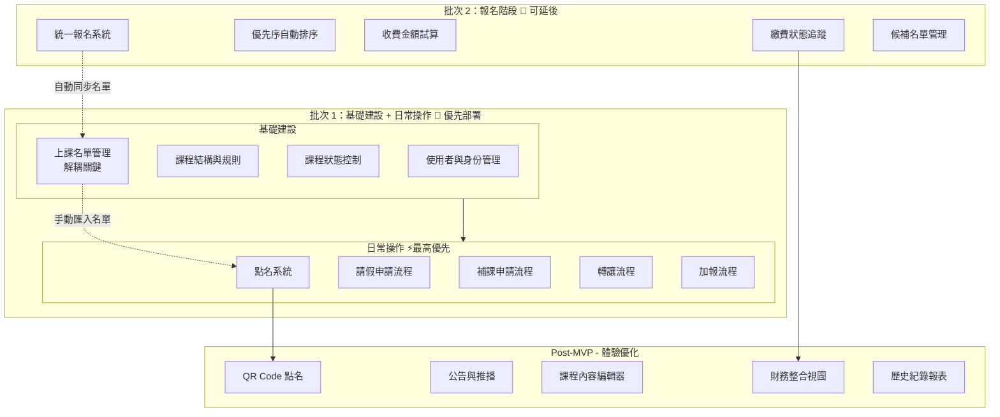

# 熱舞社管理系統 (EZD App) - Feature Plan

> 此文件會隨開發過程持續迭代更新

---

## 一、MVP vs Post-MVP 功能總覽

**MVP 目標：讓管理員只做判斷，不再做計算與整理；讓班長/副社長的日常操作有系統可依**

### MVP 批次開發策略

MVP 拆分為兩個批次，可獨立部署：

| 批次 | 內容 | 目標 | 部署時機 |
|------|------|------|----------|
| **批次 1** | 基礎建設 + 日常操作 | 讓班長/副社先開始使用 | 完成後立即上線 |
| **批次 2** | 報名階段 | 取代 SurveyCake，自動產生名單 | 報名期前完成 |

> **解耦關鍵：** 批次 1 的上課名單由管理員後台手動建立（CSV 匯入），不依賴報名系統。批次 2 完成後，報名系統產生的名單自動整合。

---

### 批次 1：基礎建設 + 日常操作（最高優先）

#### 🔧 基礎建設（一次性設定）

| # | Feature | 系統自動化功能 | 解決的痛點 | 人工保留工作 | 人工如何與 App 銜接 |
|---|---------|---------------|-----------|-------------|---------------------|
| 1 | 使用者與身份管理 | 社員/非社員/管理員/班長身份、有效期限 | 身份混亂、排序錯誤、計費錯誤 | 社員費實際收款 | 財務或副社收款後，後台更新社員狀態 |
| 2 | 課程結構與規則管理 | 課程類型、堂數、名額、扣卡數設定、課程規則模板 | 課程資訊分散、規則難重用 | 課程內容撰寫 | 課務在 App 建立課程，設定扣卡數 |
| 3 | 課程狀態控制 | Draft / Published / Closed 狀態切換 | 誤開放、超賣風險 | 決定何時公告 | 管理員手動切換 Published |
| 4 | 上課名單管理 | 手動建立/匯入名單、多來源合併 | 名單散落各處 | 維護名單 | 管理員後台 CSV 匯入或手動新增 |

#### ⚡ 日常操作（每天/不定時）— 最高優先級

| # | Feature | 系統自動化功能 | 解決的痛點 | 人工保留工作 | 人工如何與 App 銜接 |
|---|---------|---------------|-----------|-------------|---------------------|
| 5 | 點名系統（手動版） | 出席記錄、缺席追蹤、歷史查詢 | 紙本點名、點名表分散、照片回傳 | 實際點名操作 | 班長/管理員在 App 勾選出席狀況 |
| 6 | 請假申請流程 | 滿班檢查、通知候補、請假紀錄 | 私訊爆炸、對話紀錄散落 | 是否核准判斷 | 學員 App 申請，班長/管理員審核 |
| 7 | 補課申請流程 | 名額檢查、額度計算與扣減、自動記錄 | 來回溝通、額度算錯、紀錄散落 | 特例處理 | 學員 App 申請，班長/副社審核 |
| 8 | 轉讓流程 | 轉讓資格檢查、額度扣減、名單更新 | 當天轉讓混亂、非社員補繳計算 | 確認接手人 | 學員 App 申請，班長/管理員更新名單 |
| 9 | 加報流程（持堂卡報名） | 持堂卡即時報名、堂卡餘額扣除、名單自動更新 | 報名流程繁瑣、名額不同步 | 特例處理 | 學員 App 持堂卡直接報名上課 |

---

### 批次 2：堂卡制度與報名（可延後）

#### 💳 堂卡購買與課程報名（每 2 個月一次購買週期）

| # | Feature | 系統自動化功能 | 解決的痛點 | 人工保留工作 | 人工如何與 App 銜接 |
|---|---------|---------------|-----------|-------------|---------------------|
| 10 | 堂卡購買系統 | 堂卡購買入口、定價自動計算、購買時段控管 | 報名收費流程繁雜 | 財務對帳 | 學員 App 下單，顯示 QR Code 匯款，財務對帳後核發堂卡 |
| 11 | 堂卡計價與 Config | 社員/非社員定價、最小購買量、課程扣卡數、購買時段設定 | 計費規則散亂、設定不靈活 | 價格決策 | 管理員後台 Config 各項參數 |
| 12 | 堂卡餘額管理 | 堂卡餘額追蹤、使用紀錄、年度到期提醒 | 餘額計算錯誤、紀錄散落 | 特例調整 | 學員查看餘額，管理員可手動調整 |
| 13 | 繳費狀態追蹤 | 待繳 / 已匯款 / 已確認核發 / 已取消 | 催帳混亂、對帳困難 | 催帳溝通 | 學員掃 QR Code 匯款，財務對帳後系統核發 |
| 14 | 候補名單管理 | 候補自動排序、遞補邏輯 | 候補漏通知、遞補流程混亂 | 通知本人確認意願 | 系統通知候補，管理員確認後更新名單 |

> **整合方式：** 堂卡制度完成後，學員持堂卡直接在課程頁面報名上課，報名即扣卡、自動更新上課名單，與手動建立的名單合併使用。

---

**Post-MVP 目標：進一步降低溝通成本，提升使用體驗**

### Post-MVP 功能（Nice to Have）

| # | Feature | 系統自動化功能 | 解決的痛點 | 人工保留工作 | 預估 Effort |
|---|---------|---------------|-----------|-------------|-------------|
| 1 | QR Code 點名 | 掃碼自動點名、批次處理 | 手動勾選慢 | - | 約 2-3 工作天 |
| 2 | 公告與推播通知 | Email / Web Push / LINE 通知整合 | 公告不同步、候補漏通知 | 決定發不發 | 約 3-4 工作天 |
| 3 | 課程內容編輯器 | App 內 Markdown 編輯課程內容 | Wiki / App 分散 | 內容創作 | 約 2-3 工作天 |
| 4 | 財務整合視圖 | 名單 × 金流一頁式對帳 | 對帳困難、資料分散 | 實際收款 | 約 2-3 工作天 |
| 5 | 歷史紀錄報表 | 課程/學員歷史查詢、匯出 | 資料散落、交接困難 | 解讀分析 | 約 3-4 工作天 |
| 6 | 課程意向調查 | 課務蒐集社員回饋問卷 | 回饋蒐集困難 | 內容設計 | 待評估 |
| 7 | 細分管理員權限 | 依職務區分操作權限 | 權限過大或過小 | - | 待評估 |
| 8 | 報名自動排程 | 自動開放/關閉報名時間 | 手動開關易忘 | - | 視 MVP 實作情況 |

---

## 二、系統架構總覽



---

## 三、使用者角色與權限設計

### MVP 階段權限

| 角色 | 說明 | 權限範圍 |
|------|------|----------|
| 非社員 | 一般使用者 | 瀏覽課程、報名、填寫繳費資訊、查看個人記錄、申請請假/補課/轉讓 |
| 社員 | 繳交社費的使用者 | 非社員權限 + 享有優先報名與折扣 |
| 班長 | 各班課程負責人 | 社員權限 + 該班點名、審核當期補課/轉讓、查看該班名單 |
| 管理員 (admin) | 社團管理者 | 所有權限（包含班長權限，可 cover 任何班級） |

> **備註：**
> - 一個人可以同時是多個班的班長
> - 管理員自動擁有所有班長權限，可協助處理任何班級的點名/補課/轉讓
> - MVP 階段管理員不細分職務（副社長/財務/課務/宣傳），全部共用管理權限

### 角色權限對照表

| 功能 | 非社員 | 社員 | 班長 | 管理員 (admin) |
|------|--------|------|------|------|
| 瀏覽課程 | ✅ | ✅ | ✅ | ✅ |
| 報名課程 | ✅ | ✅ | ✅ | ✅ |
| 享有優先與折扣 | ❌ | ✅ | ✅ | ✅ |
| 申請請假/補課/轉讓 | ✅ | ✅ | ✅ | ✅ |
| 點名（該班） | ❌ | ❌ | ✅ | ✅ |
| 審核補課/轉讓（該班） | ❌ | ❌ | ✅ | ✅ |
| 審核補課/轉讓（跨期） | ❌ | ❌ | ❌ | ✅ |
| 審核加報 | ❌ | ❌ | ❌ | ✅ |
| 管理課程 | ❌ | ❌ | ❌ | ✅ |
| 管理報名名單 | ❌ | ❌ | ❌ | ✅ |
| 管理繳費狀態 | ❌ | ❌ | ❌ | ✅ |
| 管理社員身份 | ❌ | ❌ | ❌ | ✅ |

### Post-MVP 細分權限（參考用）

| 管理員職務 | 主要職責（依 PRD） |
|----------|---------------------|
| 副社長 | 社員名單維護、課程資訊頁管理、補課/加報處理、班長第一窗口 |
| 財務 | 收費試算、繳費狀態管理、對帳 |
| 課務 | 課程規劃與建立（聯絡老師、課費規劃、課表安排） |
| 宣傳 | 報名名單整理、課程狀態切換 |
| 社長 | 審核總覽 |

---

## 四、使用者旅程 (User Journey)

### 4.1 社員/非社員旅程



**關鍵畫面：**

1. **課程列表** - 當期課程卡片，顯示報名狀態（未開放/報名中/已截止）
2. **課程詳情** - 日期、時間、老師、費用、剩餘名額、Wiki 連結
3. **報名確認** - 已選課程、身份、試算金額
4. **個人中心** - 我的課程、繳費狀態、補課額度

---

### 4.2 班長旅程（每日操作）



**關鍵畫面：**

1. **我的班級** - 負責的班級列表
2. **今日上課** - 當日上課名單、點名介面
3. **申請審核** - 待審核的請假/補課/轉讓申請
4. **歷史紀錄** - 出席紀錄、審核紀錄

---

### 4.3 管理員旅程



**關鍵畫面：**

1. **Dashboard** - 待處理事項、當期課程狀態總覽
2. **課程管理** - 課程列表、新增/編輯課程、指派班長
3. **報名名單** - 成功/候補名單、排序調整、匯出
4. **繳費對帳** - 未繳/已繳篩選、一鍵標記
5. **社員管理** - 社員列表、身份/期限調整
6. **申請審核** - 加報申請、跨期補課申請、特例處理

---

## 五、批次 1 基礎建設 Feature 詳細規格

### Feature 1: 使用者與身份管理

**User Story:**
> 身為管理員，我需要一眼看出誰是社員、誰是班長、社員資格何時到期，讓報名排序與計費不會出錯。

**解決的痛點：**
- 身份混亂導致排序錯誤
- 計費時身份判斷錯誤
- 社員名單維護困難
- 班長權限不明確

**功能規格：**
- 使用者註冊與登入（Email + 密碼，使用 Supabase Auth）
- 身份類型：非社員 / 社員 / 班長 / 管理員 (admin)
- 社員有效期限管理
- 班長指派（每個班可有一或多位班長）
- 管理員可批次匯入現有社員名單（姓名、Email、工號）
- 管理員可手動調整使用者身份與班長指派
- 管理員自動擁有班長權限（可 cover 任何班級）

**人工如何與 App 銜接：**
- 社員費在 App 外收款
- 收款後，管理員在後台更新該使用者的社員狀態與期限
- 管理員指派各班班長

**驗收檢查清單：**
- [x] Email 註冊/登入功能
- [x] 身份顯示正確（非社員/社員/班長/管理員）
- [ ] 管理員可查看/編輯使用者
- [ ] 批次匯入社員（CSV）--> 可延後實作
- [ ] 班長指派功能 --> 需等待 Phase 3（課程管理）完成，需要課程資料才能指派班長
- [ ] 管理員可執行班長操作 --> 需等待 Phase 4-5（上課名單管理、點名系統）完成，需要課程與上課名單才能測試

---

### Feature 2: 課程結構與規則管理

**User Story:**
> 身為課務，我只想定義課程「規則」，不想每次都重新輸入相同的計費與請假規則。

**解決的痛點：**
- 課程資訊分散
- 規則設定重複勞動
- 計費規則容易出錯

**功能規格：**
- 課程規則模板（可重用）
  - 每堂扣卡數設定（預設依課程類型，可個別覆寫）
  - 補課/轉讓規則（1/4 上限等）
  - 適用課程類型（常態、試跳、特殊常態、風格體驗、專攻班、團練、表演班）
- 課程基本資料
  - 名稱、類型、老師、教室
  - 堂數、日期時間（支援單堂調整）
  - 名額上限、每堂扣卡數
  - Wiki 連結
- 報名時間設定（開始/結束）
- 課程進行中仍可開放加報

**人工如何與 App 銜接：**
- 課務在 App 建立課程基本資料
- 課程詳細內容（舞步說明等）維持在 Wiki，App 只存連結

**驗收檢查清單：**
- [ ] 課程規則模板 CRUD
- [x] 課程建立 (CourseForm)
- [x] 報名時間設定 (Schema 整合)
- [x] 課程列表頁面建立 (Admin Courses Page)

---

### Feature 3: 課程狀態控制

**User Story:**
> 身為宣傳，我需要一個不會出錯的開關，避免課程被誤開放或超賣。

**解決的痛點：**
- 課程誤開放報名
- 報名期間狀態不明確
- 超賣風險

**功能規格：**
- 課程狀態定義：
  - **Draft（草稿）**：僅管理員可見，學員看不到
  - **Published（已發布）**：學員可見課程資訊，依報名時間控制是否可報名
  - **Closed（已結束）**：課程已結束，僅供查詢
- 狀態切換權限：僅管理員可操作
- 狀態變更記錄（誰在什麼時候變更）
- 報名狀態自動判斷：
  - 未到報名時間 → 顯示「即將開放」
  - 報名時間內 → 顯示「報名中」+ 剩餘名額
  - 超過報名時間 → 顯示「已截止」

**人工如何與 App 銜接：**
- 課務完成課程設定後，通知宣傳切換為 Published
- 管理員手動控制發布時機

**驗收檢查清單：**
- [x] 三種狀態切換功能 (Draft/Published/Closed)
- [ ] 狀態變更記錄
- [x] 課程列表初步建立
- [x] 報名開放狀態邏輯 (Schema 整合)

---

### Feature 4: 上課名單管理（解耦關鍵）

**User Story:**
> 身為管理員，我需要一個地方管理上課名單，不管名單是從報名系統來的還是手動匯入的。

**解決的痛點：**
- 名單散落各處（SurveyCake、Excel、私訊）
- 批次 1 需在報名系統完成前就能使用
- 名單來源多元（報名、加報、手動調整）

**功能規格：**
- 上課名單 CRUD
- 名單來源標記：
  - `manual`：管理員手動建立/匯入
  - `enrollment`：報名系統產生（批次 2 完成後）
  - `addon`：加報產生
- CSV 匯入名單（從現有 Excel/SurveyCake 匯出）
- 手動新增/移除學員
- 名單查詢（依課程、依學員）
- 名單匯出（CSV）
- 三種來源的名單合併顯示

**人工如何與 App 銜接：**
- 批次 1 上線時：管理員從現有 Excel/SurveyCake 匯出 CSV，匯入系統
- 批次 2 完成後：報名系統自動同步名單，無需手動操作
- 加報核准後：自動新增至名單

**驗收檢查清單：**
- [ ] 上課名單 CRUD (預計於課程詳情頁實作)
- [x] CSV 匯出/匯入入口 (已於列表頁 Decouple 實作)
- [ ] 名單來源標記
- [ ] 手動新增/移除學員
- [ ] 名單查詢與匯出

---

## 六、批次 2 Feature 詳細規格（堂卡制度 - 可延後）

### Feature 10: 堂卡購買系統

**User Story:**
> 身為學員，我想在 App 直接購買堂卡，看到 QR Code 就能匯款，不用再填 SurveyCake。

**解決的痛點：**
- 報名收費流程繁雜（SurveyCake + Excel + Email）
- 繳費管道不統一
- 購買流程不透明

**功能規格：**
- 堂卡購買入口（僅購買時段內開放）
- 自動識別身份（社員/非社員）→ 對應單價
- 購買張數選擇（最小 5 張，可 config）
- 金額自動計算
- 送出訂單後顯示銀行 QR Code 供掃碼繳費
- 報名即匯款（送出即承諾付款）
- 購買時段控管（非開放時段按鈕鎖住）
- 訂單記錄追蹤

**人工如何與 App 銜接：**
- 管理員設定購買開放/關閉時間
- 學員 App 下單並掃碼匯款
- 財務核對銀行帳戶後，在 App 標記已收款 → 系統自動核發堂卡

**驗收檢查清單：**
- [ ] 堂卡購買頁面
- [ ] 身份自動識別與定價
- [ ] QR Code 匯款頁面
- [ ] 購買時段控管
- [ ] 訂單紀錄

---

### Feature 11: 堂卡計價與 Config

**User Story:**
> 身為管理員，我需要靈活設定堂卡單價、最小購買量、各課程扣卡數、購買開放時段，不用每次改程式碼。

**解決的痛點：**
- 計費規則散亂，難以維護
- 課程扣卡數不同，需靈活設定
- 購買時段需要彈性控制

**功能規格：**
- 堂卡定價設定：
  - 社員單價、非社員單價（可調整）
  - 最小購買量（預設 5，可調整）
- 課程預設扣卡數設定（依課程類型）
- 每門課程可個別覆寫扣卡數
- 購買時段設定：
  - 開放起始日/結束日
  - 購買週期（預設每 2 個月一週）
  - 手動開關（override 時段設定）
- 堂卡年度有效期設定

**人工如何與 App 銜接：**
- 管理員在後台 Config 頁面設定所有參數
- 設定完成後，前端自動依參數運作

**驗收檢查清單：**
- [ ] 定價 Config 頁面
- [ ] 扣卡數 Config（全域 + 個別課程）
- [ ] 購買時段 Config
- [ ] Config 變更即時生效

---

### Feature 12: 堂卡餘額管理

**User Story:**
> 身為學員，我想隨時查看堂卡餘額和使用紀錄。
> 身為管理員，我需要總覽所有學員的堂卡餘額。

**解決的痛點：**
- 餘額計算複雜、散落在 Excel
- 學員不知道自己還剩多少堂卡
- 管理員難以追蹤全部餘額

**功能規格：**
- 學員個人堂卡餘額頁面
  - 當前餘額（醒目顯示）
  - 使用紀錄（日期、課程、扣除數量）
  - 購買紀錄（日期、張數、金額）
  - 堂卡有效期限提醒（年底到期提醒）
- 管理員堂卡餘額總覽
  - 所有學員餘額列表（搜尋、篩選）
  - 手動調整餘額（特例處理，需填寫原因）
  - 匯出餘額報表

**人工如何與 App 銜接：**
- 系統自動追蹤餘額
- 管理員可手動調整（特例處理）

**驗收檢查清單：**
- [ ] 學員堂卡餘額頁面
- [ ] 使用紀錄列表
- [ ] 管理員餘額總覽
- [ ] 手動調整功能
- [ ] 年底到期提醒

---

### Feature 13: 繳費狀態追蹤

**User Story:**
> 身為財務，我要一眼看出誰還沒繳費，不想在 Excel 裡面比對。

**解決的痛點：**
- 催帳混亂
- 對帳困難
- 繳費狀態分散在 Email 和 Excel

**功能規格：**
- 繳費狀態：待繳費 / 已填寫匯款資訊 / 已確認 / 已取消
- 學員可查看應繳金額
- 學員填寫匯款資訊（銀行末五碼、匯款日期）
- 財務對帳介面（篩選、搜尋）
- 一鍵標記已繳費
- 繳費期限（每期手動設定）

**人工如何與 App 銜接：**
- 學員在 App 外轉帳
- 轉帳後在 App 填寫匯款資訊
- 財務核對銀行帳戶後，在 App 標記已繳費

**驗收檢查清單：**
- [ ] 學員查看應繳金額
- [ ] 學員填寫匯款資訊
- [ ] 財務對帳介面
- [ ] 繳費狀態變更 Email 通知

---

### Feature 14: 候補名單管理

**User Story:**
> 身為管理員，當有人取消時，我不想漏掉通知候補的人。

**解決的痛點：**
- 候補漏通知
- 遞補流程混亂
- 候補順序不清楚

**功能規格：**
- 候補名單依優先序排列
- 正取取消時，系統通知候補
- 管理員可手動調整候補順序
- 遞補歷程可追溯

**人工如何與 App 銜接：**
- 系統自動發送候補通知 Email
- 管理員確認候補意願後，手動更新名單

**驗收檢查清單：**
- [ ] 候補名單排序
- [ ] 取消時通知候補
- [ ] 手動調整順序
- [ ] 遞補歷程記錄

---

---

## 七、批次 1 日常操作 Feature 詳細規格（最高優先級）

> 以下功能是班長與副社長**每天都在處理**的工作，優先級最高

### Feature 5: 點名系統（手動版）

**User Story:**
> 身為班長，我不想用紙本點名再拍照回傳，直接在 App 勾選最方便。

**解決的痛點：**
- 紙本點名表散落
- 拍照回傳麻煩
- 出席紀錄難查詢
- 班長交接困難

**功能規格：**
- 班長/管理員可查看當日上課名單
- 手動勾選出席/缺席/請假
- 出席紀錄自動儲存
- 歷史出席查詢（依學員、依課程）
- 缺席提醒（可選：通知學員尚有補課額度）

**權限設計：**
- 班長：可點名自己負責的班級
- 管理員：可點名任何班級（cover 班長）

**人工如何與 App 銜接：**
- 班長上課前打開 App 查看名單
- 實際點名時勾選出席狀況
- 課後系統自動儲存

**驗收檢查清單：**
- [ ] 當日上課名單顯示
- [ ] 手動勾選出席/缺席/請假
- [ ] 出席紀錄自動儲存
- [ ] 歷史出席查詢
- [ ] 班長只能點自己的班
- [ ] 管理員可點任何班

---

### Feature 6: 請假申請流程

**User Story:**
> 身為學員，我想在 App 正式請假，不想私訊散落各處。
> 身為班長，我想知道今天誰請假，讓候補的人有機會上課。

**解決的痛點：**
- 請假私訊爆炸
- 對話紀錄散落
- 班長不知道誰請假
- 候補無法即時遞補

**功能規格：**
- 學員可在 App 申請請假
  - 選擇課程、堂次、請假原因
- 系統自動檢查：
  - 該課程是否滿班（未滿班可直接請假，滿班需通知候補）
  - 提醒剩餘補課額度
- 請假後自動更新點名單狀態
- 滿班課程請假時，自動通知候補第一位
- 請假紀錄追蹤

**權限設計：**
- 學員：申請請假
- 班長/管理員：查看請假申請、手動處理特例

**人工如何與 App 銜接：**
- 學員 App 送出請假申請
- 系統自動處理（未滿班直接核准，滿班通知候補）
- 班長可查看請假紀錄

**驗收檢查清單：**
- [ ] 請假申請表單
- [ ] 滿班檢查邏輯
- [ ] 自動更新點名單
- [ ] 通知候補機制
- [ ] 請假紀錄查詢

---

### Feature 7: 補課申請流程

**User Story:**
> 身為學員，我想直接在 App 申請補課，系統自動檢查名額跟我的額度。
> 身為班長，我不想每次都手算額度跟確認名額。

**解決的痛點：**
- 額度計算複雜（ceil 堂數/4）
- 跨區補課換算規則易錯
- 額度使用狀況難追蹤
- 來回溝通耗時
- 紀錄散落在私訊

**功能規格：**
- 學員可在 App 申請補課
  - 選擇目標課程、堂次
- 系統自動檢查：
  - 目標課程是否有空位
  - 申請者剩餘額度（ceil(堂數/4) - 已使用）
  - 跨區補課換算（特別常態缺 1 堂 = 一般常態 2 堂）
  - 補課期限（下一期第一個月底前）
- 當期補課：班長審核
- 跨期補課：副社長（管理員）審核
- 審核後自動更新點名單
- 補課紀錄追蹤

**權限設計：**
- 學員：申請補課
- 班長：審核當期補課（自己負責的班）
- 管理員：審核跨期補課、override 額度（不可抗力）

**人工如何與 App 銜接：**
- 學員 App 申請補課
- 班長/管理員審核（系統已算好額度與空位）
- 審核後自動更新名單

**驗收檢查清單：**
- [ ] 補課申請表單
- [ ] 額度自動計算（ceil(堂數/4)）
- [ ] 空位檢查
- [ ] 跨區補課換算
- [ ] 補課期限檢查
- [ ] 班長/管理員分權審核
- [ ] 額度 override 功能
- [ ] 補課紀錄查詢

---

### Feature 8: 轉讓流程

**User Story:**
> 身為學員，我臨時無法上課想轉讓給朋友，系統應該幫我處理。
> 身為班長，我要知道今天誰轉讓給誰，名單要正確。

**解決的痛點：**
- 當天轉讓混亂
- 非社員補繳計算複雜
- 名單更新不及時
- 轉讓額度計算錯誤

**功能規格：**
- 學員可在上課前申請當天轉讓
  - 填寫接手人資訊
  - 時間限制：只能在當天上課前
- 系統自動檢查：
  - 申請者轉讓額度（與補課合計 ceil(堂數/4)）
  - 接手人是否需補繳費用（非社員轉社員課程）
- 班長/管理員審核後更新點名單
- 自動計算補繳金額（如有）

**權限設計：**
- 學員：申請轉讓
- 班長/管理員：審核轉讓、更新名單

**人工如何與 App 銜接：**
- 學員 App 申請轉讓
- 班長/管理員確認接手人資格
- 審核後自動更新當天點名單
- 如需補繳，通知財務

**驗收檢查清單：**
- [ ] 轉讓申請表單
- [ ] 時間限制（當天上課前）
- [ ] 額度檢查（與補課合計）
- [ ] 非社員補繳計算
- [ ] 審核後更新點名單
- [ ] 轉讓紀錄查詢

---

### Feature 9: 課程報名（持堂卡報名）

**User Story:**
> 身為學員，我有堂卡後，想直接在 App 選課報名，即時扣卡、即時確認。
> 身為副社長，我不想再手動處理每筆加報申請。

**解決的痛點：**
- 加報流程繁瑣（填表 → 審核 → 匯款 → 對帳 → 更新名單）
- 超賣風險
- 報名資訊不同步

**功能規格：**
- 學員持堂卡直接在課程詳情頁報名
  - 顯示該課程每堂扣幾張卡
  - 顯示當前堂卡餘額
  - 選擇要報名的堂次
  - 報名當下即扣除堂卡
- 系統自動檢查：
  - 堂卡餘額是否充足
  - 目標堂次是否有空位
- 報名成功後自動更新上課名單
- 堂卡餘額不足時提示購買
- 滿班時提供候補登記

**權限設計：**
- 學員：持堂卡報名（無需審核）
- 管理員：可手動調整報名（特例處理）

**人工如何與 App 銜接：**
- 學員 App 持堂卡直接報名
- 系統自動扣卡、更新名單
- 管理員只需處理特例

**驗收檢查清單：**
- [ ] 課程頁面報名入口
- [ ] 堂卡餘額顯示
- [ ] 扣卡邏輯正確
- [ ] 即時名額顯示
- [ ] 報名後自動更新名單
- [ ] 堂卡不足提示
- [ ] 滿班候補登記

---

## 八、技術備註

### 認證
- Supabase Auth（Email + Password）
- 測試階段：管理員批次建立帳號，預設密碼

### Email
- 使用 Supabase 內建 Email 發送
- 發送至使用者註冊 Email

### 資料匯入
- 現有社員資料格式：姓名、Email、工號
- 支援 CSV 匯入

### UI/UX
- MVP 使用簡約/預設 CSS
- 之後提供設計截圖，生成主視覺 design scheme
- 設計為可配置的 CSS 變數

---

## 九、Post-MVP 功能詳細評估

### 8.1 QR Code 點名（約 2-3 工作天）

**User Story:**
> 身為班長，手動勾選可以用，但掃 QR Code 更快。

**功能規格：**
- QR Code 掃碼點名（html5-qrcode）
- 批次掃碼處理
- 離線支援（PWA）
- 與手動點名系統整合

**前置條件：** MVP 點名系統已完成

---

### 8.2 公告與推播通知（約 3-4 工作天）

**User Story:**
> 身為管理員，我不想一直回答重複的私訊問題，系統應該主動通知學員重要訊息。

**功能規格：**
- Email 通知（使用 Supabase Email 或第三方如 Resend）
- Web Push API（PWA 支援）
- LINE Notify 整合（可選）
- 通知類型：報名開放、繳費提醒、候補遞補、課程異動
- 通知偏好設定（學員可選擇接收方式）

---

### 8.3 課程內容編輯器（約 2-3 工作天）

**User Story:**
> 身為課務，我不想在 App 跟 Wiki 之間來回貼連結，想在同一個地方管理課程內容。

**功能規格：**
- Markdown 編輯器（舞步說明、課程備註）
- 圖片上傳（Supabase Storage）
- 版本歷史（可選）

---

### 8.4 財務整合視圖（約 2-3 工作天）

**User Story:**
> 身為財務，我想在一頁完成對帳，不想在多個 Excel 之間比對。

**功能規格：**
- 名單 × 金流一頁式 Dashboard
- 篩選：依課程、繳費狀態、日期
- 批次標記已繳費
- 匯出對帳報表
- 期別盈虧預估

---

### 8.5 歷史紀錄報表（約 3-4 工作天）

**User Story:**
> 身為管理員，我想要交接時不用重新解釋，歷史資料應該清楚可查。

**功能規格：**
- 課程歷史紀錄（每期課程、報名人數、收費總額）
- 學員歷史紀錄（上過哪些課、繳費紀錄、補課紀錄）
- 匯出 CSV / Excel
- 跨期統計（年度報表）

---

### 8.6 課程意向調查（待評估）

**User Story:**
> 身為課務，我想知道社員對下一期課程的偏好。

**功能規格：**
- 問卷建立（課程類型、老師偏好、時段偏好）
- 結果統計與視覺化

---

### 8.7 細分管理員權限（待評估）

**功能規格：**
- 依 PRD 職務細分權限
- 副社長：社員名單、補課加報
- 財務：繳費管理、對帳
- 課務：課程建立
- 宣傳：報名名單、狀態切換

---

### 8.8 報名自動排程（視 MVP 實作情況）

**功能規格：**
- 設定報名開放/關閉時間後自動執行
- 使用 Supabase Edge Functions 或 Vercel Cron

---

## 十、開發檢查清單

> **開發策略：** 分兩批次開發，批次 1（日常操作）優先上線，批次 2（報名階段）可延後或並行開發。

---

### 🚀 批次 1：基礎建設 + 日常操作（優先部署）

#### Phase 1: 基礎建設
- [ ] Next.js 專案（App Router）
- [ ] Supabase 專案建立與設定
- [ ] Supabase Auth 設定
- [ ] 基礎 UI 元件庫
- [ ] 響應式佈局框架
- [ ] 專案部署至 Vercel

#### Phase 2: 使用者管理（Feature 1）
- [x] 註冊/登入功能
- [ ] 使用者 Profile 頁面
- [x] 身份類型管理（非社員/社員/班長/管理員）
- [ ] 社員有效期限欄位
- [ ] 班長指派功能 --> 需等待 Phase 3（課程管理）完成
- [ ] admin 後台：使用者列表與編輯
- [ ] 批次匯入社員（CSV）--> 可延後實作
- [ ] 管理員可執行班長操作 --> 需等待 Phase 4-5（上課名單管理、點名系統）完成

#### Phase 3: 課程管理（Feature 2 & 3）
- [ ] 課程規則模板 CRUD
- [ ] 課程 CRUD
- [ ] 課程狀態控制（Draft/Published/Closed）
- [ ] 課程列表頁面
- [ ] 課程詳情頁面
- [ ] Wiki 連結整合
- [ ] 班長與課程的關聯

#### Phase 4: 上課名單管理（Feature 4）【解耦關鍵】
- [ ] 上課名單 CRUD
- [ ] CSV 匯入名單（從現有 Excel/SurveyCake 匯出）
- [ ] 手動新增/移除學員
- [ ] 名單來源標記（手動/報名系統/加報）
- [ ] 名單查詢與匯出

#### Phase 5: ⚡ 點名系統（Feature 5）
- [ ] 當日上課名單顯示（從上課名單管理讀取）
- [ ] 手動勾選出席/缺席/請假
- [ ] 出席紀錄自動儲存
- [ ] 歷史出席查詢（依學員、依課程）
- [ ] 班長只能點自己的班
- [ ] 管理員可點任何班

#### Phase 6: ⚡ 請假/補課/轉讓（Feature 6 & 7 & 8）
- [ ] 請假申請表單與流程
- [ ] 滿班檢查邏輯
- [ ] 請假後自動更新點名單
- [ ] 補課申請表單與流程
- [ ] 額度自動計算（ceil(堂數/4)）
- [ ] 跨區補課換算
- [ ] 補課期限檢查
- [ ] 班長審核當期補課
- [ ] 管理員審核跨期補課
- [ ] 額度 override 功能
- [ ] 轉讓申請表單與流程
- [ ] 轉讓時間限制（當天上課前）
- [ ] 非社員補繳計算

#### Phase 7: ⚡ 課程報名 - 持堂卡報名（Feature 9）
- [ ] 課程頁面報名入口
- [ ] 堂卡餘額顯示
- [ ] 扣卡邏輯（報名即扣卡）
- [ ] 即時名額顯示
- [ ] 堂卡不足提示
- [ ] 報名後自動更新上課名單（source = 'card_enrollment'）
- [ ] 滿班候補登記

#### 🎯 批次 1 部署里程碑
- [ ] 批次 1 整合測試
- [ ] 批次 1 部署上線
- [ ] 班長開始使用點名系統
- [ ] 副社開始處理請假/補課/轉讓

---

### 💳 批次 2：堂卡制度（可延後或並行開發）

#### Phase 8: 堂卡購買系統（Feature 10 & 11）
- [ ] 堂卡購買頁面 UI
- [ ] 身份自動識別（社員/非社員）→ 對應單價
- [ ] 購買張數選擇（最小 5 張）
- [ ] 金額自動計算
- [ ] 銀行 QR Code 匯款頁面
- [ ] 購買時段控管（開放/關閉）
- [ ] 管理員 Config 頁面（定價、最小購買量、購買時段、課程扣卡數）
- [ ] 訂單紀錄管理

#### Phase 9: 堂卡餘額與繳費管理（Feature 12 & 13）
- [ ] 學員堂卡餘額頁面
- [ ] 使用紀錄（扣卡明細）
- [ ] 購買紀錄
- [ ] 繳費狀態追蹤（待繳 / 已匯款 / 已確認核發 / 已取消）
- [ ] 財務對帳介面
- [ ] 一鍵確認收款 → 核發堂卡
- [ ] 管理員餘額總覽與手動調整
- [ ] 年底堂卡到期提醒

#### Phase 10: 候補管理（Feature 14）
- [ ] 候補名單管理
- [ ] 候補遞補通知
- [ ] 遞補歷程記錄
- [ ] 報名確認通知
- [ ] 名單/明細匯出（CSV）

#### 🎯 批次 2 部署里程碑
- [ ] 批次 2 整合測試
- [ ] 批次 2 部署上線
- [ ] 堂卡購買系統上線，取代過去單堂報名制

---

### Phase 11: 收尾與測試
- [ ] Email 模板設計
- [ ] 資料匯出功能整合
- [ ] 端對端測試
- [ ] 效能優化
- [ ] 文件撰寫
- [ ] 正式部署

---

## 十一、尚未被系統解決的痛點

以下痛點在 MVP 與 Post-MVP 中尚未完全自動化，需依賴現有人工流程：

| 痛點 | 目前銜接方式 | 未來可能解決方案 |
|-----|-------------|-----------------|
| 年度課表規劃（課務） | 課務線下與老師敲定，手動輸入系統 | 行事曆整合、老師端介面 |
| 老師門禁管理（副社） | 公司系統，與此系統無關 | N/A |
| 海報/文宣製作（宣傳） | 使用設計工具，App 僅儲存檔案 | 模板系統（低優先） |
| 社團經費報帳（財務） | 公司流程，與此系統無關 | N/A |

---

## 十二、MVP 與 Post-MVP 功能對照圖



---

## 十三、MVP 開發優先順序建議

### 批次 1：優先部署（讓班長/副社先用起來）

| 優先級 | Phase | 功能 | 原因 |
|--------|-------|------|------|
| 🔴 P0 | 1-3 | 基礎建設、使用者、課程 | 其他功能的前置條件 |
| 🔴 P0 | 4 | 上課名單管理 | 解耦關鍵：手動匯入名單，不依賴報名系統 |
| 🟠 P1 | 5 | 點名系統 | 班長每天都要用，最高頻操作 |
| 🟠 P1 | 6 | 請假/補課/轉讓 | 班長/副社每天都在處理的事項 |
| 🟡 P2 | 7 | 加報流程 | 課程進行中不定時發生 |

### 批次 2：可延後（報名期前完成即可）

| 優先級 | Phase | 功能 | 原因 |
|--------|-------|------|------|
| 🟢 P3 | 8 | 報名系統 + 排序 | 取代 SurveyCake，可與批次 1 並行開發 |
| 🟢 P3 | 9 | 計費與繳費 | 每期處理一次，可暫時人工處理 |
| 🟢 P3 | 10 | 候補管理 | 可暫時人工處理 |

---

## 十四、解耦策略說明

### 上課名單的雙軌制

批次 1 與批次 2 透過「上課名單管理」解耦：

| 階段 | 名單來源 | 說明 |
|------|---------|------|
| 批次 1 上線時 | 手動建立 | 管理員從現有 Excel/SurveyCake 匯出 CSV，匯入系統 |
| 批次 2 完成後 | 報名系統 | 報名完成後，名單自動同步至上課名單管理 |
| 日常操作 | 合併使用 | 手動建立 + 報名系統 + 加報，三者合併 |

### 名單來源標記

```
source = 'manual'      # 管理員手動建立/匯入
source = 'enrollment'  # 報名系統產生
source = 'addon'       # 加報產生
```

> **優點：** 批次 1 完成後即可上線，班長先開始使用點名系統；批次 2 可並行開發或延後，不影響日常操作。
